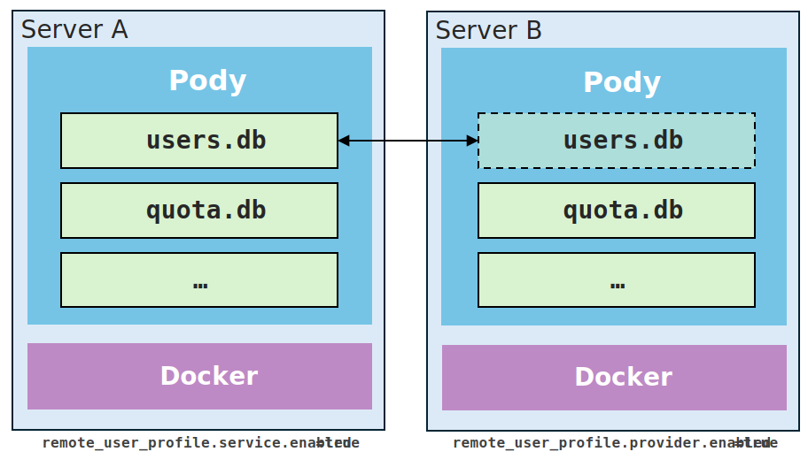

# Remote User Profile
> Added in v0.4.0

Pody can use another Pody server as the source of truth for user accounts.

This feature is useful when you run multiple clusters and want to:

- keep one shared user database;
- authenticate users against a central server;
- avoid creating the same users separately on every node.

The feature has two sides:

- `enable service`: exposes the local user database through a protected HTTP API;
- `enable provider`: consumes that API from another Pody server.

In practice, one server acts as the **user-profile service**, and another server acts as the **consumer**.

## What It Affects

When `remote_user_profile.provider.enabled = true`, Pody switches `UserDatabase()` from the local SQLite database to the remote provider.

That means the following operations on the consumer node use the remote user database:

- user authentication;
- user listing;
- password changes;
- CLI user-management commands such as `pody-user add`, `update`, `list`, and `delete`.

::: info NOTE
1. **user quota is still local to each server**. Remote user profiles only replace the user-account backend; they do not synchronize quota settings.
2. **user management may not always work through the provider**. 
If `remote_user_profile.service.readonly = true`, then the consumer server can only read user profiles but cannot create, update, or delete users through the service API. In that case, you must manage users directly on the service node.
:::


## Topology


Typical deployment:

- **Server A**: keeps the real user database and enables `remote_user_profile.service`.
- **Server B**: points `remote_user_profile.provider.endpoint` to Server A and authenticates users against it.

## Service (provider) Side

Enable the service on the server that owns the user database.

Edit `$PODY_HOME/config.toml`:

```toml
[remote_user_profile.service]
enabled = true
readonly = true
access_token = "replace-with-a-long-random-token"
```

Use `readonly = true` if other nodes should only read users from this server.

Set `readonly = false` only if you want remote nodes to create, update, or delete users through this server.

## Client (consumer) Side

Enable the provider on the consumer server.

Edit `$PODY_HOME/config.toml`:

```toml
[remote_user_profile.provider]
enabled = true
endpoint = "http://server-a.example.com:8799"
access_token = "replace-with-the-same-token-used-by-the-service"
```

## Security Notes

This feature is simple by design, so you should treat it as an internal service interface.

- Use a long random token for `access_token`.
- Prefer a trusted private network or HTTPS reverse proxy between clusters.
- Keep `readonly = true` unless you explicitly want remote nodes to create, modify, or delete users.