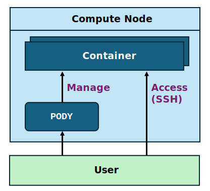

# Pody

Pody is a container manager that adds a layer of abstraction on top of Docker. 
It uses server-client architecture to expose API for managing containers.  

Specifically: 

- It restricts the user to only manage containers under the user's namespace.  
- Limit avaliable images and their exposed ports to a predefined list.  
- Easy resource management and monitoring. 

<!-- This is an experimental setup for our lab* 😊 -->

# Next
- If you use pody client, you can check the [Client documentation](./pody-cli.md).
- If you are looking for the API documentation, please check the [API reference](./api.md).
- If you want to deploy Pody, you can follow the [Deployment guide](./deploy/).
