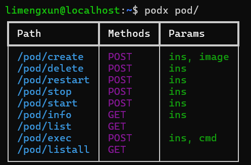

# 快速入门

## 安装客户端工具
```sh
pip install pody
```
如果以前安装过，请使用`pody version`检查与服务器的兼容性。

## 连接到服务器 
首先，从管理员处获得一个节点IP、账号和密码，例如三者分别为`10.254.29.178:8799`，`limengxun`和`123`，
然后设置好相应环境变量：
```sh
export PODY_API_BASE="http://10.254.29.178:8799";
export PODY_USERNAME="limengxun";
export PODY_PASSWORD="123";
```

::: tip
如果你的使用场景要在多个计算节点之间切换，或者需要频繁使用不同的账号，
更好的方法是将这些环境变量写入脚本文件中，参考[这里](./pody-cli#configuration)。  
:::

接着，你可以使用`pody` 和 `podx`命令来管理pod了，首先测试一下是否能够连接到服务器，如无问题则会返回用户信息：
```sh
podx user/info
```
::: details 结果示例
```json
{'user': {'name': 'limengxun', 'is_admin': 0}, 'quota': {'max_pods': -1, 'gpu_count': -1, 'memory_limit': -1}}
```
:::

`podx`用以发送HTTP请求到服务器，所有可用的路径可在[API文档](./api.md)中查看。  


## 创建一个容器
然后，拉取可用镜像名称列表：
```sh
podx image/list
```
::: details 结果示例
```json
['ubuntu:18.04', 'nvidia/cuda:11.0-base', 'nvidia/cuda:11.0-runtime', 'nvidia/cuda:11.0-devel']
```
:::

从中选取一个需要的镜像，例如`nvidia/cuda:11.0-base`，然后创建一个容器：
```sh
podx pod/create image:nvidia/cuda:11.0-base ins:main
```
`podx (pody fetch)`命令使用`<key>:<value>`的形式传递参数，
其中`ins:main`表示创建一个名为`main`的pod实例。

## 查看容器状态
```sh
podx pod/inspect ins:main
```
::: details 结果示例
```json
{
    'name': 'limengxun-main',
    'status': 'running',
    'image': 'nvidia/cuda:11.0-base',
    'port_mapping': ['20806:22', '20299:8000'],
    ...
}
```
:::
此时可以看到`main`容器已经运行起来了，且映射了两个端口，其中22端口映射到20806端口，可以通过`ssh`连接到容器。

## 运行命令
虽然可以通过`ssh`连接到容器，但是我们首先需要确保ssh服务已开启，并且将我们的公钥添加到容器的`~/.ssh/authorized_keys`文件中，
可以通过以下命令来执行容器内的命令：
```sh
podx pod/exec ins:main cmd:"service ssh start"
```
::: details 结果示例
```json
{'exit_code': 0, 'log': ' * Starting OpenBSD Secure Shell server sshd       \x1b[80G \r\x1b[74G[ OK ]\r\n'}
```
:::


接下来，通过以下命令将本地的公钥上传到容器中：
```sh
pody copy-id ins:main
```

::: details 结果示例
```json
{'exit_code': 0, 'log': ''}
```
:::

<!-- podx pod/exec ins:main cmd:"mkdir -p ~/.ssh && echo $(cat ~/.ssh/id_rsa.pub) >> ~/.ssh/authorized_keys" -->
:::tip
如果要执行多条命令，或者需要避免使用`"`进行空格转义，可以直接写成脚本，然后以管道传递。
例如，如下命令创建一个脚本`init.sh`用以设置ssh服务并添加公钥，并通过管道传递给`podx`远程执行：
```sh
# 构建脚本
echo "service ssh start && \\" > init.sh
echo "mkdir -p ~/.ssh && \\" >> init.sh
echo "echo $(cat ~/.ssh/id_rsa.pub) >> ~/.ssh/authorized_keys" >> init.sh
# 执行脚本
cat init.sh | podx pod/exec ins:main cmd:
```
:::

此时，我们就可以通过`ssh`连接到容器了🎉：
```sh
ssh -p 20806 root@10.254.29.178
```

:::warning
用户通常有资源使用限制，可以通过`user/info`查看。  
如果超过使用限制，Pody守护进程可能会杀掉你的容器，
此时可以重启容器，并在`/log/pody/...`目录下查看日志文件以排查问题。
:::

## 查看帮助
如果记不住路径和对应参数怎么办？可以使用帮助命令：
```sh
pody help /path/to/route
```

此外，当`podx`应用于`/`结尾的路径时，也会显示帮助，例如：
<!--  -->
```sh
limengxun@localhost:~$ pody help pod/
```
输出：
| Path          | Methods | Params             |
|---------------|---------|--------------------| 
| /pod/create   | POST    | ins, image         |
| /pod/delete   | POST    | ins                |    
| /pod/restart  | POST    | ins                |
| /pod/stop     | POST    | ins                |
| /pod/start    | POST    | ins                |
| /pod/commit   | POST    | ins, tag?, msg?    |
| /pod/inspect  | GET     | ins                |
| /pod/list     | GET     |                    |
| /pod/exec     | POST    | ins, cmd, timeout? |
| /pod/info     | GET     | ins                |


## 更多操作
更多操作请参考[API文档](./api.md)。  
关于Pody-CLI的更多信息请参考[这里](./pody-cli.md)。  

<style scoped>
    img {
        margin-top: 1rem;
        max-width: 24rem;
        filter: invert(1);
    }
</style>